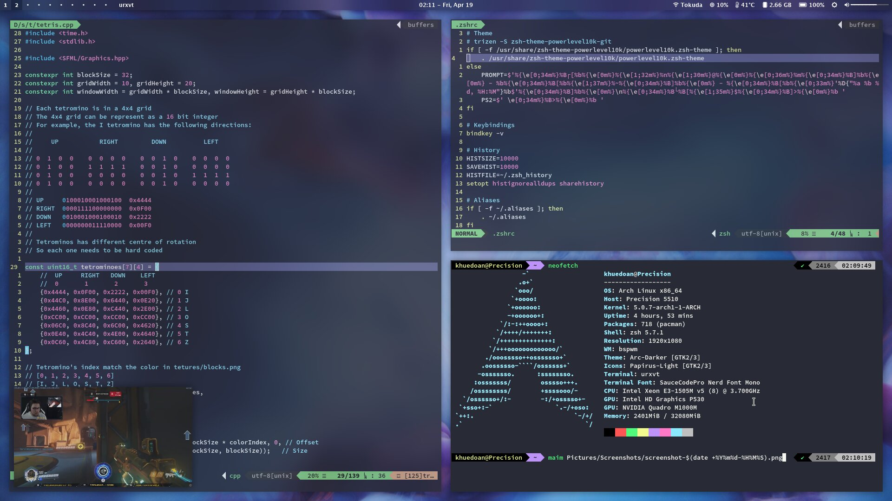

# Arch Linux Rice

Pretending to be busy while watching YouTube video in Picture-in-Picture mode

## Getting Started

You can install this rice right after Arch Linux installation

### Prerequisites

The install script below assumes you installed Arch with [my instruction](https://github.com/khuedoan98/archguide). You can also install these dotfiles manually

You will need at least these packages for this rice to be usable (use the install script bellow for automatic installation):

Base:
`dash`
`xorg-server`
`xorg-xinit`
`bspwm`
`sxhkd`
[`dmenu2`](https://aur.archlinux.org/packages/dmenu2/)
[`polybar`](https://aur.archlinux.org/packages/polybar/)
`rxvt-unicode`

Fonts:
[`nerd-fonts-source-code-pro`](https://aur.archlinux.org/packages/nerd-fonts-source-code-pro/)
[`ttf-mac-fonts`](https://aur.archlinux.org/packages/ttf-mac-fonts/)

Optional:
[`compton-tryone-git`](https://aur.archlinux.org/packages/compton-tryone-git/)
[`i3lock-next-git`](https://aur.archlinux.org/packages/i3lock-next-git/)

### Installation

#### The lazy way

`curl -Lks https://khuedoan.me/dotfiles/install.sh > install.sh`

`chmod +x install.sh`

`./install.sh`

#### The better way

1. Fork this repo.

2. Edit the `REPO` variable in `install.sh` and commit.

3. Clone with `git clone https://github.com/YOURGITHUBUSERNAME/YOURREPONAME.git"`

4. Run the install script

`cd YOURREPONAME`

`chmod +x install.sh`

`./install.sh`

#### The best way

I know the above one is not the best, so please help me to find out ;)

### Usage

#### Quick start

`super + /`        for help

`super + enter`    for terminal

`super + space`    for app launcher

`super + ctrl + q` to quit app

The Capslock key is now Escape when tapping and Control when holding.

#### Version control

Make change to the dotfiles to suit your needs, then use `dotfiles` command instead of `git` for version control

For example:

`dotfiles add .config/foo`

`dotfiles commit`

`dotfiles push`

Check out `.aliases` for more

## Recommended packages

These are the packages I usually have in my Arch Linux system:

`sudo pacman -S alsa-utils arc-gtk-theme aria2 bbswitch bc bspwm bumblebee colordiff dunst fcitx fcitx-configtool fcitx-im fcitx-unikey feh firefox fzf glances htop lib32-nvidia-utils lib32-virtualgl libreoffice-fresh lxappearance maim mesa mpv networkmanager network-manager-applet nvidia nvidia-settings openssh papirus-icon-theme pcmanfm playerctl powertop ranger rxvt-unicode sxhkd thefuck tlp tmux translate-shell ttf-dejavu vim unrar unzip w3m xarchiver xcape xclip xf86-video-intel xorg-xbacklight xorg-xinit xorg-xsetroot youtube-dl zathura zip zsh zsh-autosuggestions zsh-syntax-highlighting`

`trizen -S compton-tryone-git dmenu2 i3lock-next-git nerd-fonts-source-code-pro polybar ttf-mac-fonts ttf-ms-fonts`

## Acknowledgments

- **thugcee** for [show sxhkd key bindings with fuzzy search script](https://www.reddit.com/r/bspwm/comments/aejyze/tip_show_sxhkd_keybindings_with_fuzzy_search/)
