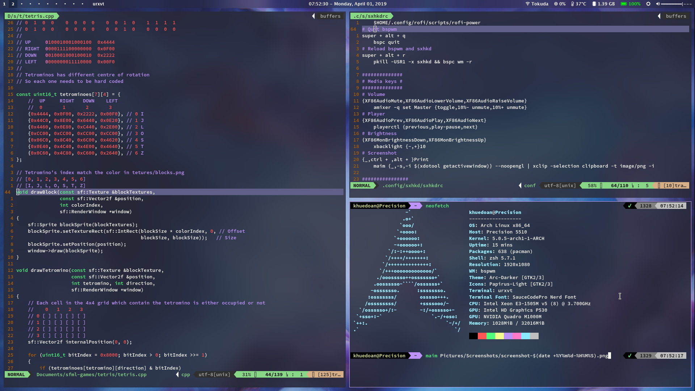

# Arch Linux Rice

My bspwm rice on Arch Linux

## Screenshots

## Getting Started

You can install this rice right after Arch Linux installation

After installation, use `super + /` to show key bindings

### Prerequisites

You will need at least these packages for this rice to be usable:

[`bspwm`](https://www.archlinux.org/packages/community/x86_64/bspwm/)

[`sxhkd`](https://www.archlinux.org/packages/community/x86_64/sxhkd/)

[`polybar`](https://aur.archlinux.org/packages/polybar/)

[`rofi`](https://www.archlinux.org/packages/community/x86_64/rofi/)

[`rxvt-unicode`](https://www.archlinux.org/packages/community/x86_64/rxvt-unicode/) or any terminal of choice, edit [sxhkdrc](.config/sxhkd/sxhkdrc) to launch different one

Fonts:

[`nerd-fonts-source-code-pro`](https://aur.archlinux.org/packages/nerd-fonts-source-code-pro/)

[`ttf-mac-fonts`](https://aur.archlinux.org/packages/ttf-mac-fonts/)

Optional:

[`compton-tryone-git`](https://aur.archlinux.org/packages/compton-tryone-git/)

[`i3lock-next-git`](https://aur.archlinux.org/packages/i3lock-next-git/)

### Installation

You can quickly install this rice by running this command:

`curl -Lks https://raw.githubusercontent.com/khuedoan98/dotfiles/master/install.sh | /bin/bash`

Or just clone this repo and manually copy only the files you need

## Recommended packages

These are the packages I usually have in my Arch Linux system:

`sudo pacman -S alsa-utils arc-gtk-theme aria2 bbswitch bc bspwm bumblebee colordiff dunst fcitx fcitx-configtool fcitx-im fcitx-unikey feh firefox fzf htop lib32-nvidia-utils lib32-virtualgl libreoffice-fresh lxappearance maim mesa mpv networkmanager network-manager-applet nvidia nvidia-settings openssh papirus-icon-theme pcmanfm playerctl powertop ranger rofi rxvt-unicode sxhkd tlp tmux translate-shell ttf-dejavu vim unrar unzip w3m xarchiver xcape xclip xf86-video-intel xorg-xbacklight xorg-xinit xorg-xsetroot youtube-dl zathura zip zsh zsh-autosuggestions zsh-syntax-highlighting`

`trizen -S compton-tryone-git i3lock-next-git nerd-fonts-source-code-pro polybar ttf-mac-fonts ttf-ms-fonts`

## Acknowledgments

- **sumnerevans** for [rofi calculator script](https://github.com/sumnerevans/menu-calc)
- **thugcee** for [show sxhkd key bindings with fuzzy search script](https://www.reddit.com/r/bspwm/comments/aejyze/tip_show_sxhkd_keybindings_with_fuzzy_search/)
